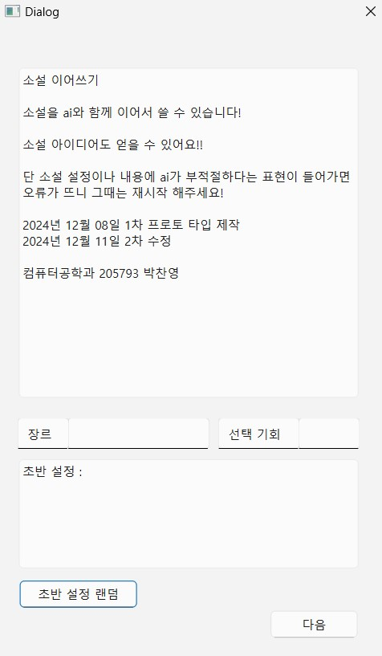

# ✍️ AI Novel Relay (Socket-based Text Adventure)

사용자가 설정한 장르와 시나리오를 바탕으로 Google Gemini API와 실시간 데이터를 주고받으며 서사를 완성해 나가는 소켓 기반 텍스트 어드벤처 프로젝트입니다.

## 🖥️ 서비스 화면


## 📌 주요 기능
* **실시간 소켓 통신**: TCP/IP 소켓을 이용한 서버-클라이언트 데이터 송수신 구현
* **AI 시나리오 생성**: Gemini Pro 모델을 활용한 문맥 유지 및 후속 이야기 생성
* **랜덤 스타터**: 초반 설정 구성을 어려워하는 사용자를 위한 자동 시나리오 생성 기능
* **세션 관리**: 사용자 입력 시마다 선택 기회(Choice Limit) 차감 및 종료 시 엔딩 시퀀스 전환

## 💻 Tech Stack
* **Language**: Python 3.x
* **GUI Framework**: PyQt6
* **AI Engine**: Google Gemini Pro API
* **Network**: Socket (TCP/IP)
* **Environment**: Virtualenv

## 📡 Network Protocol Design
데이터 전송 효율과 파싱의 용이성을 위해 `|` (Pipe) 구분자를 사용한 프로토콜을 설계했습니다.

| 구분 | 프로토콜 (Message Format) | 설명 |
| :--- | :--- | :--- |
| **Client → Server** | `INIT\|장르\|초반설정` | 게임 시작 시 설정값 및 시나리오 데이터 전송 |
| **Client → Server** | `CONTINUE\|장르\|사용자입력` | 사용자 릴레이 텍스트 및 장르 정보 전송 |
| **Server → Client** | `OK\|AI생성내용` | 생성된 시나리오 및 스토리 텍스트 응답 |
| **Server → Client** | `ERROR\|메시지` | 예외 발생 및 부적절 표현 필터링 시 응답 |

## 🛠️ Technical Decisions & Troubleshooting
* **언어 선택 이유**: C++ 소켓 환경 대비 Gemini API와의 라이브러리 호환성 및 개발 생산성이 높은 Python을 선택했습니다.
* **의존성 관리**: 프로젝트 간 패키지 종속성 충돌을 방지하기 위해 가상환경(`virtualenv`)을 구축하고 독립적인 런타임 환경을 유지했습니다.
* **보안 정책 해결**: PowerShell에서 가상환경 활성화 시 발생하는 보안 오류(`PSSecurityException`)를 해결하기 위해 정책을 완화하여 해결했습니다.
* **에러 핸들링**: AI 모델의 Safety Setting으로 인해 차단된 응답 발생 시, 서버에서 에러 프로토콜을 전송하고 클라이언트에서 재시작을 유도하도록 설계했습니다.

## ⚙️ Getting Started
1. **가상환경 활성화**
   ```bash
   .\venv\Scripts\activate